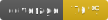

<div align="center">




# Bootstrap 5 Theme Switcher
##### Enable seamless switching between light, dark and system default modes.


[](https://www.php.net/)
[](https://www.symfony.com/)
[](https://getbootstrap.com/)
</div>

---

## Install
Add my recipe repository endpoint in your project's `composer.json` as described in the 
[Symfony documentation](https://symfony.com/doc/current/setup/flex_private_recipes.html#configure-your-project-s-composer-json-file).
```json
{
  "extra": {
    "symfony": {
      "endpoint": [
        "https://api.github.com/repos/neuralglitch/symfony-recipes/contents/index.json",
        "flex://defaults"
      ]
    }
  }
}
```

> [!WARNING]
> If you don't, Composer will not use the Symfony Flex recipe for this bundle and you will need to follow these
> [manual installation instructions](docs/install.md). 

> [!TIP]
> The `extra.symfony` key will most probably already exist in your `composer.json`. In that case, add the `endpoint` 
> key to the existing `extra.symfony` entry.

```bash
composer require neuralglitch/bootstrap-theme-switch
```
Execute the appropriate commands to build the frontend, if necessary.

---

## Usage
### Modify the base template
`templates/base.html.twig`
```html
<html 
    data-bs-theme="{{ app.session.get('_theme', 'light') }}" 
    data-system-theme="{{ app.session.get('_is_system_theme', '0') }}">
```

### Include one of the partial templates anywhere
i.e. `templates/partials/footer.html.twig`
```twig
    ...
    
    ...
```
or
```twig
    ...
    
    ...
```

If that's not enough, refer to the [advanced usage instructions](./docs/usage.md).

### Now start to switch the Bootstrap theme in your application without glitches.

---

## Uninstall
> [!WARNING]
> Wiithout the Symfony Flex recipe, Composer will not completely remove the bundle and you will need to follow these
> [manual removal instructions](./docs/remove.md).
```bash
composer remove neuralglitch/bootstrap-theme-switch
```
Execute the appropriate commands to build the frontend, if necessary.

---

## What' next?
[Upcoming features](./docs/next.md)

---

Copyright (c) 2024 [Neural Glitch](https://neuralglit.ch)